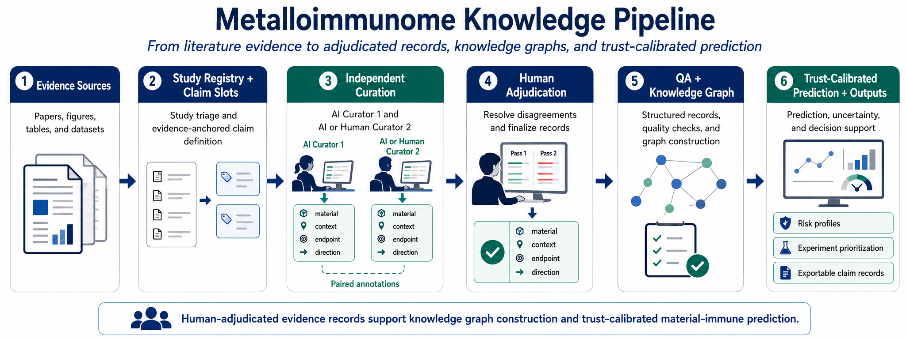

# Metalloimmunome Claim Curation Pilot

This repository contains a local Streamlit + SQLite curation app used to generate preliminary claim-level data for a proposal on context-conditioned metal–immune interactions. The app supports paper registry, shared claim slots, paired curator annotations, annotation locking, adjudication, QA, agreement metrics, and grant-packet export.



**Figure.** Metalloimmunome knowledge pipeline. Evidence sources are converted into study registry entries and evidence-anchored claim slots, independently curated, human-adjudicated, quality-checked, and used to support knowledge graph construction and trust-calibrated material–immune prediction.

## What this is

This is a local pilot curation cockpit for preliminary data generation. It helps organize the workflow from paper registry to claim slots, paired annotations, locked annotations, adjudication, QA, metrics, and export.

The app is meant to replace a fragile spreadsheet when claim-level curation needs stable IDs, controlled labels, explicit missingness, preserved raw annotations, and reproducible grant-facing metrics.

Demo fixtures are seeded on first run so reviewers can see the workflow immediately. Demo rows are excluded from grant-facing metrics and exports by default.

## What this is not

This repository is not the full Metalloimmunome platform.

It is also not:

- a public web service
- a RAG system
- a PDF ingestion pipeline
- a graph database
- a prediction model
- an automated literature-mining system
- a cloud deployment
- an authentication system
- a public API

The app does not automatically extract claims from papers. It is a local tool for structured curation and adjudication.

## Pilot workflow

The Streamlit app has six tabs:

- **Papers**: register papers, track metadata, and import paper-registry CSV files.
- **Claim Slots**: create shared evidence anchors such as a figure, table, or results paragraph.
- **Annotate**: enter one structured annotation for one curator and one claim slot, then lock it after checking the primary paper.
- **Adjudicate**: compare locked paired annotations and save the final human-adjudicated record.
- **Codebook + QA**: review field definitions, controlled vocabularies, export rules, and data-quality flags.
- **Metrics + Export**: review pilot metrics, download CSVs, create the grant-packet ZIP, and download a SQLite backup.

The intended workflow is:

```text
paper registry -> claim slots -> paired annotations -> locked annotations -> adjudication -> QA/metrics/export
```

## Curation model

The pilot records are human-adjudicated records generated from two independent AI-assisted curation passes.

The curator/adjudicator labels used for the pilot are:

- `GPT_CURATOR`
- `CLAUDE_CURATOR`
- `JG_ADJUDICATOR`

The app preserves original curator annotations and exports adjudicated records when present. If a claim slot has not been adjudicated, exports fall back to raw annotation records for that slot.

Do not describe this repository as containing two independent human curators, automated extraction, or a full metalloimmunome dataset unless those exported files are explicitly committed and identified.

## Grant packet outputs

The grant-packet ZIP is generated locally from the **Metrics + Export** tab. Demo rows are excluded by default.

The packet contains:

- `curated_claim_records.csv`
- `paper_registry.csv`
- `claim_slots.csv`
- `pilot_metrics.csv`
- `agreement_report.csv`
- `data_quality_report.csv`
- `data_dictionary.csv`
- `example_claims.csv`
- `proposal_summary.md`
- `README_grant_packet.md`

The public repository does not need to contain local export ZIPs or SQLite databases. Proposal claims should be based on the exported adjudicated grant packet, not on demo fixtures.

## Installation

From the repository root:

```bash
python3 -m venv .venv
.venv/bin/python -m pip install -r requirements.txt
./run-app
```

Streamlit prints a local URL such as:

```text
http://localhost:8501
```

Open that URL in a browser. On first launch, Streamlit may ask for an onboarding email. Pressing Enter with a blank email is fine.

## Development checks

Run the test suite with:

```bash
.venv/bin/python -m pytest
```

GitHub Actions runs `pytest` on pushes and pull requests if enabled for the repository.

## Data and privacy

The app is local-first.

- The local SQLite database lives under `data/`.
- Local SQLite files are ignored by git.
- Export ZIPs and CSVs are ignored by git.
- No secrets are required.
- No cloud service is required.
- No telemetry is implemented.

Do not commit local SQLite databases, exported grant packets, PDFs, secrets, or private curation artifacts unless the project explicitly decides to publish them.

## Citation / proposal use

This repository can be cited in the proposal as the software artifact supporting the preliminary curation workflow. The scientific claims should be based on the exported adjudicated grant packet, not on demo fixtures.
